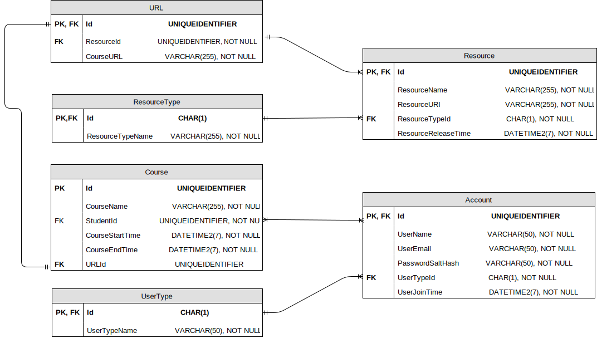

# Functional Specifications for LMS

## 1. LMS ER Diagram

### (1) Course Model

<a href="https://drive.google.com/file/d/1FzIM7mha6Pk4huKQnVi-nPBDsmrfkSai/view?usp=sharing">Edit this</a>

## 2. Description

//todo

### (1) Course Model

* In course model, students can access specific course by a single page identified by an URL which contains various resources identified by unique URI including videos, quizzes, QA Feed, tutorials and so on.
* Same resource can be used by different courses.
* Whether students can access specific course depends on two factors: course start&end time and studentID is included by specific course.

